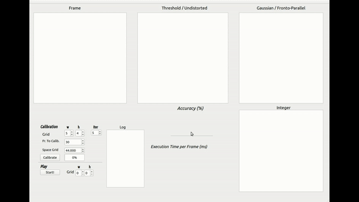
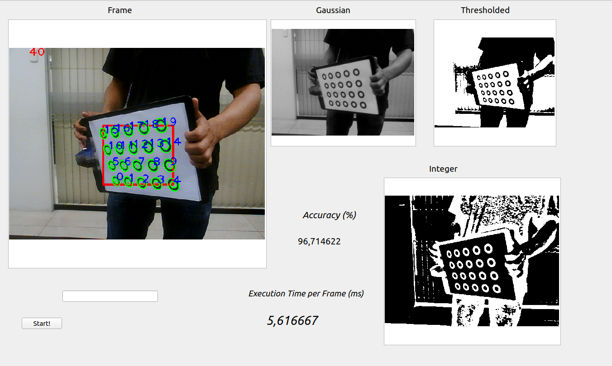
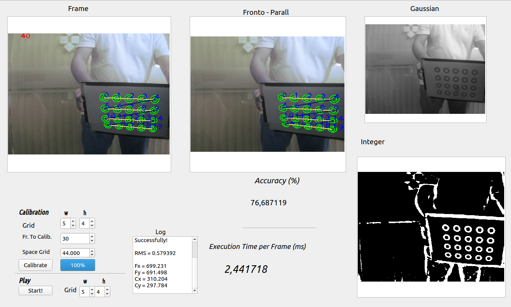
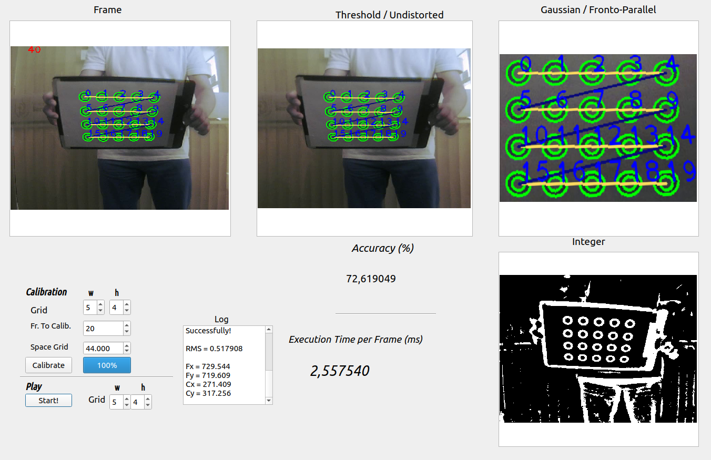

*This repository is the new location for the previous working in:*
`https://github.com/erickTornero/Image-Processing/tree/master/Pattern_Recognizion`
*the last will be removed in the feature.*

# Camera Calibration

## Contributors
- [Walter Zuniga](https://github.com/wzuniga)

## Requirements
* c++11
* Opencv 3.4
* QT Creator 5.12

## Follow the instructions to execute Pattern Recognizion
### Install

Clone repository:

`git clone https://github.com/erickTornero/Camera-Calibration.git`

Open Right folder:

`cd Camera-Calibration/Aplication/`

Open the project in QT, or compile with the following commands:

`qmake Aplication.pro`

Compile Project running the makefile:

`make`

### Execute the program:

`./Aplication`

### Examples:

Calibrating example:

Detenction an tracking of pattern with 12 Centers:

Detenction an tracking of pattern with 20 Centers:

### Executing Calibration of Camera

### Fronto paralell

